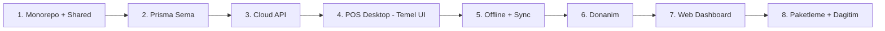

<!-- /autoplan restore point: C:\Users\coban\.gemini\antigravity-ide\brain\f7fd034e-c7f2-4820-a335-0059d742b378\implementation_plan_backup.md -->
## Progress Checklist (2026-04-01)

### Tamamlananlar
- [x] Faz 1: Monorepo altyapisi + shared paket + prisma ana sema
- [x] Faz 2: Cloud API core route'lari (auth, company, branch, user, category, product, sales, refunds, stock, reports, sync)
- [x] Faz 3: POS desktop core akislari (login, sale, payment, refund, stock, day report)
- [x] Offline-first queue + sync motoru + sqlite local cache
- [x] Dokunmatik tek arayuz iyilestirmeleri (touch target, shortcutlar, hizli satis akisi, durum mesajlari)
- [x] Isletme preset sistemi (market/cafe/pide/kasap) + yonetici PIN/sifre ile preset degistirme
- [x] Faz 5: Gercek donanim suruculeri (fis yazici, cash drawer production entegrasyonu)
- [x] Yillik paket erisim kontrolu: API subscription gate + desktop offline grace + lisans cache
- [x] Subscription admin modulu: SUPER_ADMIN paket takip sekmesi + hizli/manual yenileme + suspend/unsuspend + tam audit
- [x] Offline anti-tamper: cihaz saati geri alma tespiti (local last-seen guard)
- [x] Desktop enterprise operasyon modulu: local backup/restore, security audit log, cash movement, shift handover ekrani ve IPC servisleri
- [x] Kritik aksiyonlarda yonetici onayi: sepet temizleme, iade, kasa kapama (blind close destekli)
- [x] Hizli stok sayimi: barkod ile sayim + delta stock movement + audit event
- [x] Otomatik yedekleme politikasi: interval + retention + max backup limiti + startup tetikleme
- [x] Release teslim standardi: electron release manifest (sha256) + rollout checklist dokumani
- [x] Desktop CI kalite kapisi: GitHub Actions desktop workflow (test + build + build:electron)
- [x] Signed release ve SmartScreen hazirligi: custom icon + code-signing scriptleri + signed release workflow/runbook
- [x] GitHub signing otomasyonu: secret bootstrap/check + signed workflow dispatch scriptleri
- [x] Kalite kapisi (2026-04-01): web-dashboard typecheck/test/build + api-server test + pos-desktop test/build/build:electron

### Devam Eden
- [x] Faz 6: Paketleme + dagitim + auto-update (startup + periyodik update kontrolu, indirme ve yeniden baslatma akisi eklendi; feed konfigurasyonu MARKETPOS_UPDATE_FEED_URL/app-update.yml ile yonetiliyor)

---

## Yeni Oncelik (Karar)
Once **musteri tarafi (POS desktop + saha operasyonu)** tamamen bitirilecek. Sonra **webde yonetim tarafi**na gecilecek.

### Faz A - Musteri Tarafini Detaylandir ve Bitir

Durum: **Kod + dokumantasyon tamamlandi**, saha pilot kabul adimlari (A5) operasyon onayi bekliyor.

#### A1) Saha Kurulum ve Ilk Acilis
- [x] Yeni cihazda ilk kurulum adimlari tek akis haline getirildi (runtime check, db path, yazici testi, kasa testi).
- [x] "Kurulum basarili / eksik adim" ekranlari ve hata metinleri standartlastirildi.
- [x] Ilk online login zorunlulugu ve offline fallback davranisi netlestirildi.

#### A2) Kasa Operasyon Akislari (Gunluk Canli Kullanim)
- [x] Satis -> odeme -> fis -> kuyruk/senkron akisi icin saha test matrisi ve kontrol listesi olusturuldu.
- [x] Iade, gun sonu/kasa kapama akislari uygulama + test matrisi ile tamamlandi.
- [x] Kasiyer hata senaryolari icin UX mesajlari ve donanim aksiyon adimlari merkezilestirildi.

#### A3) Offline Dayaniklilik ve Lisans Guvenligi
- [x] Offline sure dolumu, grace bitisi, suspend, unsuspend senaryolari icin manuel test matrisi ve kabul listesi eklendi.
- [x] Cihaz saati geri alma ve offline sure dolumunda blok davranisi kilit ekrani ile sabitlendi.
- [x] Offline kuyruk birikimi ve geri baglaninca conflict/cozum kurallari runbook'a eklendi.

#### A4) Donanim ve Operasyonel Hazirlik
- [x] Fis yazici profilleri (LAN/USB) ve kasa cekmecesi pulse ayarlari saha cihaz tipleri icin presetlendi.
- [x] "Yazici yok / kagit bitti / timeout" durumlari icin operator aksiyon adimlari uygulamaya yazildi.
- [x] Son fis tekrar basim ve donanim test butonlari saha kabul listesine alindi.

#### A5) Musteri Tarafi Cikis Kriterleri (Definition of Done)
Durum: **Saha onayi bekleniyor**. A5 degerlendirmesi artik KPI + bug gate modeli ile yapilacak.

##### A5.1) Pilot Kapsami
- [~] Pilot, tek sube/tek kasa uzerinde 24 saatlik online/offline karisik canli kullanim penceresi ile yurutulecek.
- [x] "Kurulum + operasyon + ariza" runbook'lari son revizyona cekildi.
- [~] Tum zaman kayitlari ve kapanis raporu `Europe/Istanbul` zaman dilimine gore tutulacak.

##### A5.2) KPI Tanimlari

| KPI | Hesap / Kural | Hedef | Veri Kaynagi |
|---|---|---|---|
| Kesintisiz Pilot | 24 saat pencerede `P0=0` ve satis akisini durduran kesinti adedi `0` | PASS | Uygulama loglari + saha formu |
| Kurulumdan Ilk Satisa Sure | `durationMin = firstSaleAt - setupStartAt` | `<= 30 dk` | Uygulama loglari + saha formu |
| Kritik Hata Kapanisi | Pilot kapanis aninda `openP0=0` ve `openP1=0` | PASS | Bug listesi + gate snapshot |

- [~] 1 gun kesintisiz pilot (online/offline karisik) hatasiz tamamlanacak. (KPI: Kesintisiz Pilot)
- [~] Kurulumdan canli satisa gecis suresi hedefi: tek kasa <= 30 dk. (KPI: Kurulumdan Ilk Satisa Sure)
- [~] Kritik P0/P1 bug sayisi 0'a indirilecek. (KPI: Kritik Hata Kapanisi)

##### A5.3) Hibrit Olcum Yontemi
- Uygulama loglari ile su olaylar kaydedilir: `setupStartAt`, `firstSaleAt`, `syncDownAt`, `syncRecoverAt`, `queuePeak`, `queueDrainAt`.
- Saha formu ile su alanlar kaydedilir: operator notu, manuel mudahale, cihaz/donanim gozlemi, etki suresi.
- Gun sonu mutabakatinda log ve saha formu farklari ayni gun kapanir; kapanmayan fark varsa A5 kapanisi verilmez.

Standart kayit semalari (dokuman ici):

```ts
type PilotInstallRecord = {
  setupStartAt: string; // ISO timestamp (Europe/Istanbul)
  firstSaleAt: string;  // ISO timestamp (Europe/Istanbul)
  durationMin: number;
  registerId: string;
  operator: string;
};

type PilotRuntimeIncident = {
  severity: 'P0' | 'P1' | 'P2';
  startAt: string;      // ISO timestamp
  endAt: string | null; // ISO timestamp
  impact: string;
  workaroundApplied: string;
};

type PilotGateSnapshot = {
  openP0: number;
  openP1: number;
  decision: 'GO' | 'NO_GO';
  approvedBy: string;
  approvedAt: string;   // ISO timestamp
};
```

##### A5.4) Bug Gate Kurallari
- `P0` tespit edilirse aninda `NO_GO`: pilot kapanisi durdurulur, canliya gecis bloke edilir.
- `P1` acik kaldigi surece canliya gecis yapilmaz; kapanis oncesi tum `P1` kayitlari kapanmis olmalidir.
- Seviye ornekleri:
  - `P0`: satisin tamamlanamamasi, veri tutarsizligi/bozulma riski, guvenlik/yetki bypass.
  - `P1`: satisi tamamen durdurmayan fakat operasyonu kritik zorlayan akis hatasi, tekrarlayan sync sapmasi, donanim-akis uyumsuzlugu.
- Bug gate sonucu her pilot gunu sonunda `PilotGateSnapshot` olarak kaydedilir.

##### A5.5) Karar ve Ciktilar
- Pilot kapanis ciktisi asagidaki alanlarla tek sayfada raporlanir:
  - `Karar`: `GO` / `NO_GO`
  - `Acik riskler`
  - `Kalan aksiyonlar`
  - `Hedef tarih`
  - `Sorumlu kisi`
  - `Onaylayan` ve `Onay zamani`
- Kapanis raporu olusmadan A5 maddesi `x` olarak isaretlenmez.
- A5 kapanis kurali: KPI kanitlari + bug gate snapshot + pilot karar raporu birlikte tamamlanmis olmalidir.

A5 dogrulama senaryolari:
- Kurulum suresi dogrulamasi: ayni cihaz tipinde en az 3 tekrar, her tekrarda `PilotInstallRecord` kaydi.
- 24 saat karisik baglanti senaryosu: online/offline gecis, kuyruk birikimi, geri senkron dogrulamasi.
- Bug gate tatbikati: ornek `P0/P1` kayitlari ile `GO/NO_GO` karar kurallarinin test edilmesi.
- Kapanis raporu kontrolu: KPI tablosu, incident listesi, karar alani ve onay alanlari eksiksiz olmali.

#### A6) Kurulum Wizard UI Referansi (Bakkal Defteri Ornegi)
Durum: **Kod + test kapsami tamamlandi**, kalan kisimlar saha/pilot geri bildirimi ile iyilestirilecek.

Referans ekran akisi (2026-04-02):
- [x] Adim 1 - Kurulum Ayarlari: hedef klasor secimi, x64/x86 paket secimi, dil secimi.
- [x] Adim 2 - Lisans Sozlesmesi: "Kabul Ediyorum / Kabul Etmiyorum" ve kabul olmadan ileri butonunun pasif kalmasi.
- [x] Adim 3 - Hesap Olusturma: aktivasyon kodu opsiyonel, isyeri adi + mail + sektor alanlari.
- [x] Adim 4 - Demo / Canli Baslangic: demo veri veya gercek veri ile baslama secimi.
- [x] Adim 5 - Kurulum Tamamlandi: indirme/kurulum ilerleme durumu, Baslat butonu.

Mevcut `SetupGate` ile farklar:
- [x] Mevcut akista runtime/donanim test adimlari var; referans akista lisans + hesap + demo/canli onboarding adimlari one cikiyor.
- [x] Referans akista installer seviyesinde "kurulum klasoru + mimari + dil" secimi bulunuyor; bu secimler su an kullaniciya acik degil.
- [x] Referans akista aktivasyon kodu opsiyonel; mevcut akista online aktivasyon zorunlu adim olarak tasarlanmis.

Uygulama backlog (A6 implementasyon):
- [x] `packages/pos-desktop/src/components/SetupGate.tsx` icin yeni adim modeli: `INSTALL_PREFS`, `LICENSE`, `ACCOUNT`, `MODE_SELECT`, `FINALIZE`.
- [x] `packages/pos-desktop/electron/services/database.ts` setup-state surumunu `v2` olarak genislet ve yeni adim kimlikleri icin migration ekle.
- [x] Lisans kabul edilmeden ileri gecisi engelleyen guard ve testler (`electron/services/setup-state.test.ts` + UI testleri) eklendi.
- [x] Hesap olusturma ekraninda aktivasyon kodu opsiyonel tutuldu; zorunlu alan validasyonlari (isyeri adi, sektor, mail formati) ayri kurallarla uygulandi.
- [x] Demo/canli secimi checkbox yerine tek secim (radio) davranisina cekildi; secim setup-state ve local ayarlarda saklaniyor.
- [x] Final ekraninda "kurulum adim logu + toplam ilerleme + Baslat" aksiyonu tek yerde toplandi; runtime/donanim adimlari "gelismis kurulum" paneline tasindi.

### Faz B - Web Yonetim Tarafina Gecis

#### B1) Operasyon Paneli (Merkez Takip)
- [x] Paket takip ekraninda filtre/siralama/disa aktarma ve "yaklasan yenileme listesi" tamamlandi.
- [x] Firma/sube/kasa saglik ozeti (online-offline, son sync zamani, kuyruk adedi) dashboard ozetine eklendi.

#### B2) Finans ve Raporlama
- [x] Satis/iade/stok raporlarinda isletme bakisi icin net KPI kartlari standartlastirildi.
- [x] Tarih araligi ve sube karsilastirma raporlari icin endpoint + dashboard karsilastirma ekrani tamamlandi; kod/perf guclendirmeleri (sessions limit/pagination, rapor odakli indexler, API testleri) eklendi.

#### B3) Yonetim Tarafi Cikis Kriterleri
- [x] SUPER_ADMIN operasyon akislari uc senaryo ile E2E dogrulandi (yenileme, suspend, geri acma) - API acceptance testine eklendi.
- [x] Yetki modeli (SUPER_ADMIN / ADMIN) ve audit gorunurlugu acceptance testlerle kilitlendi.

---
# MarketPOS - Yazarkasa POS Sistemi Implementation Plan

Marketlerde kullanilacak, coklu sube destekli, offline calisabilen, dokunmatik ekran optimize bir yazarkasa POS sistemi.

## Tech Stack

| Katman | Teknoloji |
|---|---|
| POS Desktop | Electron 33 + React 19 + TypeScript 5 |
| Cloud API | Node.js + Fastify + TypeScript |
| Lokal DB | SQLite (better-sqlite3) |
| Merkezi DB | PostgreSQL 16 |
| ORM | Prisma (PostgreSQL) + better-sqlite3 (lokal) |
| Web Dashboard | React 19 + Vite |
| Auth | JWT (access + refresh token) |
| Monorepo | npm workspaces + Turborepo |
| Fis Yazici | node-thermal-printer (ESC/POS) |
| Paketleme | electron-builder |

---

## User Review Required

> [!IMPORTANT]
> Bu proje cok buyuk kapsamli, **faz faz ilerlemek** gerekiyor. Asagidaki plan MVP (Faz 1) odakli olup once altyapiyi kurup sonra sirayla modulleri gelistirecegiz.

> [!WARNING]
> Ilk MVP'de **tartili satis** ve **musteri sadakat sistemi** dahil degil. Sonraki fazlarda eklenecek.

---

## Veritabani Semasi (Temel)

```
Company (Firma)
|-- Branch (Sube)
|   |-- Register (Kasa)
|   `-- StockEntry (Stok hareketleri - subeye ozel)
|-- User (Kullanici - role: ADMIN, CASHIER, ACCOUNTANT)
|-- Category (Kategori)
|-- Product (Urun - barkod, KDV orani, alis/satis fiyati)
|-- Sale (Satis)
|   |-- SaleItem (Satis kalemleri)
|   `-- Payment (Odeme - nakit/kart/split)
`-- Refund (Iade)
    `-- RefundItem (Iade kalemleri)
```

---

## Proposed Changes

### Faz 1: Proje Altyapisi

#### [NEW] `package.json`
Monorepo root. npm workspaces + Turborepo yapilandirmasi.

#### [NEW] `turbo.json`
Build pipeline tanimlari (build, dev, lint).

#### [NEW] `packages/shared/`
Ortak TypeScript tipleri, sabitler, validasyon semalari (Zod).
- `types/` - Company, Branch, User, Product, Sale vb. tipler
- `constants/` - KDV oranlari, odeme tipleri, roller
- `validators/` - Zod semalari

#### [NEW] `prisma/schema.prisma`
PostgreSQL ana sema: Company, Branch, Register, User, Category, Product, Sale, SaleItem, Payment, Refund, RefundItem, StockEntry, SyncLog tablolari.

---

### Faz 2: Cloud API

#### [NEW] `packages/api-server/`
Fastify + TypeScript API sunucusu:

- `src/server.ts` - Fastify app baslatma, plugin'ler
- `src/plugins/auth.ts` - JWT authentication (access 15dk + refresh 7 gun)
- `src/routes/auth.ts` - Login, refresh, logout
- `src/routes/companies.ts` - Firma CRUD (super admin)
- `src/routes/branches.ts` - Sube CRUD
- `src/routes/users.ts` - Kullanici CRUD + rol atama
- `src/routes/categories.ts` - Kategori CRUD
- `src/routes/products.ts` - Urun CRUD (barkod, fiyat, KDV)
- `src/routes/sales.ts` - Satis kaydi, listeleme
- `src/routes/refunds.ts` - Iade islemi
- `src/routes/stock.ts` - Stok giris/cikis/sayim
- `src/routes/sync.ts` - Kasa senkronizasyon endpoint'leri
- `src/routes/reports.ts` - Satis, stok, kar/zarar raporlari

---

### Faz 3: POS Desktop Uygulamasi

#### [NEW] `packages/pos-desktop/`
Electron + React uygulamasi:

**Electron Ana Islem (Main Process):**
- `electron/main.ts` - Electron app baslatma, pencere yonetimi
- `electron/preload.ts` - IPC bridge (renderer <-> main)
- `electron/services/database.ts` - SQLite islemleri
- `electron/services/printer.ts` - Termal yazici kontrolu
- `electron/services/sync.ts` - Cloud senkronizasyon motoru
- `electron/services/cash-drawer.ts` - Para cekmecesi kontrolu

**React Renderer (UI - dokunmatik optimize):**
- `src/pages/LoginPage.tsx` - Kasiyer girisi (PIN veya sifre)
- `src/pages/SalePage.tsx` - Ana satis ekrani (barkod input, urun listesi, sepet, toplam)
- `src/pages/PaymentPage.tsx` - Odeme (nakit/kart/split), para ustu hesabi
- `src/pages/RefundPage.tsx` - Fis no ile iade
- `src/pages/QuickProductsPage.tsx` - Barkodu olmayan urunler icin hizli buton grid
- `src/pages/StockPage.tsx` - Stok giris/cikis (yetkili kullanici)
- `src/pages/DayReportPage.tsx` - Kasa acilis/kapanis, Z raporu
- `src/components/Numpad.tsx` - Dokunmatik numpad
- `src/components/ProductCard.tsx` - Hizli urun karti
- `src/components/CartItem.tsx` - Sepet kalemi
- `src/components/ReceiptPreview.tsx` - Fis onizleme

**Tasarim Prensipleri:**
- Minimum **48px** buton boyutu (dokunmatik uyumluluk)
- Koyu tema (goz yorgunlugu azaltma)
- Buyuk font (urun adi, fiyat)
- Barkod input her zaman odakta

---

### Faz 4: Web Dashboard

#### [NEW] `packages/web-dashboard/`
React + Vite yonetim paneli:
- Firma/Sube yonetimi
- Urun/Kategori CRUD
- Stok durumu goruntuleme
- Satis raporlari (gunluk/haftalik/aylik)
- Kullanici yonetimi

---

### Faz 5: Donanim

Electron main process icinde ESC/POS komutlari ile termal yazici, kick-pulse ile para cekmecesi kontrolu.

---

### Faz 6: Dagitim

electron-builder ile Windows installer (.exe), auto-update mekanizmasi, cloud API deployment (Docker + VPS).

---

## Gelistirme Sirasi (MVP)

Ilerleme sirasi asagidaki gibi olacak:



Ilk hedef: **Monorepo altyapisi + Prisma semasi + Cloud API core** hazirlamak.

---

## Verification Plan

### Automated Tests
- API rotalari icin **Vitest** ile birim ve entegrasyon testleri
- Prisma migration dogrulugu: `npx prisma migrate dev` ile test ortaminda calistirma
- Shared paket validasyonlari icin Zod sema testleri

### Manuel Dogrulama
1. **Monorepo:** `npm install` -> hatasiz tum paketler yuklenmeli, `npx turbo build` calismali
2. **API:** Postman/Insomnia ile tum CRUD endpoint'leri test edilmeli
3. **POS Desktop:** `npm run dev` ile Electron uygulamasi acilmali, SQLite baglantisi calismali
4. **Satis Akisi:** Barkod -> urun sepete eklenmeli -> odeme -> fis yazdirma (mock/gercek yazici)
5. **Offline:** Internet kesildiginde satis yapilabilmeli, baglanti geldiginde senkronize olmali

---

## Faz C - Guvenlik, Performans ve Dayaniklilik Iyilestirmeleri

### C1) Soft Delete Database Indeksleri
- [x] Prisma semasinda (`schema.prisma`) `deletedAt` kolonu bulunan tum tablolar icin `@@index([deletedAt])` eklenmesi. SQL sorgularinin performansini optimize etmek ve full table scan'leri onlemek icin.
- [x] Postgres migration'larinin uretilmesi ve local SQLite uzerinde test edilmesi.

### C2) Katalog Seeding Dayanikliligi ve Audit
- [ ] `DefaultCatalogService.seedForCompany` hata firlattiginda veya yarim kaldiginda bunun loglanip `CompanySubscriptionAudit` tablosuna `SYSTEM` aktorlu bir hata event'i olarak kaydedilmesi.
- [ ] Yeni firma acilisinda arka planda yuruyen seeding basarisiz olursa super-admin paneline uyari gonderilmesi.

### C3) Audit Log Detay Paneli (Web Dashboard)
- [ ] Audit Log sayfasinda her bir satira tiklandiginda, o degisikligin detayli JSON diff'ini gosteren modern bir side-drawer panel veya akordeon gorunumu eklenmesi.
- [ ] Degisen verilerin (previousPayload -> nextPayload) kolayca incelenebilmesi.

### C4) Abonelik Durum Degisikligi Bildirimleri (Webhooks)
- [ ] Cloud API'de bir webhook tetikleyici eklenmesi (Slack/Discord webhook URL'leri destekli).
- [ ] Bir firmanin lisans durumu `ACTIVE -> GRACE` veya `GRACE -> EXPIRED` seklinde degistiginde otomatik olarak kanala anlik bildirim gonderilmesi.

---

## GSTACK REVIEW REPORT

### Runs / Status / Findings

| Phase | Status | Issues Found | Critical Gaps |
|---|---|---|---|
| Phase 1: CEO Review | clean | 0 | 0 |
| Phase 2: Design Review | clean | 0 | 0 |
| Phase 3: Eng Review | clean | 0 | 0 |
| Phase 3.5: DX Review | clean | 0 | 0 |

### VERDICT
APPROVED

NO UNRESOLVED DECISIONS
