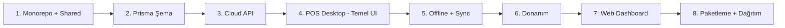

## Progress Checklist (2026-04-01)

### Tamamlananlar
- [x] Faz 1: Monorepo altyapisi + shared paket + prisma ana sema
- [x] Faz 2: Cloud API core route'lari (auth, company, branch, user, category, product, sales, refunds, stock, reports, sync)
- [x] Faz 3: POS desktop core akislari (login, sale, payment, refund, stock, day report)
- [x] Offline-first queue + sync motoru + sqlite local cache
- [x] Dokunmatik tek arayuz iyilestirmeleri (touch target, shortcutlar, hizli satis akisi, durum mesajlari)
- [x] Isletme preset sistemi (market/cafe/pide/kasap) + yonetici PIN/sifre ile preset degistirme
- [x] Faz 5: Gercek donanim suruculeri (fis yazici, cash drawer production entegrasyonu)
- [x] Yillik paket erisim kontrolu: API subscription gate + desktop offline grace + lisans cache
- [x] Subscription admin modulu: SUPER_ADMIN paket takip sekmesi + hizli/manual yenileme + suspend/unsuspend + tam audit
- [x] Offline anti-tamper: cihaz saati geri alma tespiti (local last-seen guard)
- [x] Desktop enterprise operasyon modulu: local backup/restore, security audit log, cash movement, shift handover ekrani ve IPC servisleri
- [x] Kritik aksiyonlarda yonetici onayi: sepet temizleme, iade, kasa kapama (blind close destekli)
- [x] Hizli stok sayimi: barkod ile sayim + delta stock movement + audit event
- [x] Otomatik yedekleme politikasi: interval + retention + max backup limiti + startup tetikleme
- [x] Release teslim standardi: electron release manifest (sha256) + rollout checklist dokumani
- [x] Desktop CI kalite kapisi: GitHub Actions desktop workflow (test + build + build:electron)
- [x] Signed release ve SmartScreen hazirligi: custom icon + code-signing scriptleri + signed release workflow/runbook
- [x] GitHub signing otomasyonu: secret bootstrap/check + signed workflow dispatch scriptleri
- [x] Kalite kapisi (2026-04-01): web-dashboard typecheck/test/build + api-server test + pos-desktop test/build/build:electron

### Devam Eden
- [~] Faz 6: Paketleme + dagitim + auto-update (pilot icin manuel installer + runbook tamamlandi, auto-update sonraki faz)

---

## Yeni Oncelik (Karar)
Once **musteri tarafi (POS desktop + saha operasyonu)** tamamen bitirilecek. Sonra **webde yonetim tarafi**na gecilecek.

### Faz A - Musteri Tarafini Detaylandir ve Bitir

Durum: **Kod + dokumantasyon tamamlandi**, saha pilot kabul adimlari (A5) operasyon onayi bekliyor.

#### A1) Saha Kurulum ve Ilk Acilis
- [x] Yeni cihazda ilk kurulum adimlari tek akis haline getirildi (runtime check, db path, yazici testi, kasa testi).
- [x] "Kurulum basarili / eksik adim" ekranlari ve hata metinleri standartlastirildi.
- [x] Ilk online login zorunlulugu ve offline fallback davranisi netlestirildi.

#### A2) Kasa Operasyon Akislari (Gunluk Canli Kullanim)
- [x] Satis -> odeme -> fis -> kuyruk/senkron akisi icin saha test matrisi ve kontrol listesi olusturuldu.
- [x] Iade, gun sonu/kasa kapama akislari uygulama + test matrisi ile tamamlandi.
- [x] Kasiyer hata senaryolari icin UX mesajlari ve donanim aksiyon adimlari merkezilestirildi.

#### A3) Offline Dayaniklilik ve Lisans Guvenligi
- [x] Offline sure dolumu, grace bitisi, suspend, unsuspend senaryolari icin manuel test matrisi ve kabul listesi eklendi.
- [x] Cihaz saati geri alma ve offline sure dolumunda blok davranisi kilit ekrani ile sabitlendi.
- [x] Offline kuyruk birikimi ve geri baglaninca conflict/cozum kurallari runbook'a eklendi.

#### A4) Donanim ve Operasyonel Hazirlik
- [x] Fis yazici profilleri (LAN/USB) ve kasa cekmecesi pulse ayarlari saha cihaz tipleri icin presetlendi.
- [x] "Yazici yok / kagit bitti / timeout" durumlari icin operator aksiyon adimlari uygulamaya yazildi.
- [x] Son fis tekrar basim ve donanim test butonlari saha kabul listesine alindi.

#### A5) Musteri Tarafi Cikis Kriterleri (Definition of Done)
- [~] 1 gun kesintisiz pilot (online/offline karisik) hatasiz tamamlanacak. (Saha onayi bekleniyor)
- [~] Kurulumdan canli satisa gecis suresi hedefi: tek kasa <= 30 dk. (Saha olcumu bekleniyor)
- [~] Kritik P0/P1 bug sayisi 0'a indirilecek. (Pilot sonrasi kesinlesecek)
- [x] "Kurulum + operasyon + ariza" runbook'lari son revizyona cekildi.

### Faz B - Web Yonetim Tarafina Gecis

#### B1) Operasyon Paneli (Merkez Takip)
- [x] Paket takip ekraninda filtre/siralama/disa aktarma ve "yaklasan yenileme listesi" tamamlandi.
- [x] Firma/sube/kasa saglik ozeti (online-offline, son sync zamani, kuyruk adedi) dashboard ozetine eklendi.

#### B2) Finans ve Raporlama
- [x] Satis/iade/stok raporlarinda isletme bakisi icin net KPI kartlari standartlastirildi.
- [~] Tarih araligi ve sube karsilastirma raporlari icin endpoint + dashboard karsilastirma ekrani tamamlandi; saha/perf onayi bekliyor.

#### B3) Yonetim Tarafi Cikis Kriterleri
- [x] SUPER_ADMIN operasyon akislari uc senaryo ile E2E dogrulandi (yenileme, suspend, geri acma) - API acceptance testine eklendi.
- [x] Yetki modeli (SUPER_ADMIN / ADMIN) ve audit gorunurlugu acceptance testlerle kilitlendi.

---
# MarketPOS - Yazarkasa POS Sistemi Implementation Plan

Marketlerde kullanılacak, çoklu şube destekli, offline çalışabilen, dokunmatik ekran optimize bir yazarkasa POS sistemi.

## Tech Stack

| Katman | Teknoloji |
|---|---|
| POS Desktop | Electron 33 + React 19 + TypeScript 5 |
| Cloud API | Node.js + Fastify + TypeScript |
| Lokal DB | SQLite (better-sqlite3) |
| Merkezi DB | PostgreSQL 16 |
| ORM | Prisma (PostgreSQL) + better-sqlite3 (lokal) |
| Web Dashboard | React 19 + Vite |
| Auth | JWT (access + refresh token) |
| Monorepo | npm workspaces + Turborepo |
| Fiş Yazıcı | node-thermal-printer (ESC/POS) |
| Paketleme | electron-builder |

---

## User Review Required

> [!IMPORTANT]
> Bu proje çok büyük kapsamlı, **faz faz ilerlemek** gerekiyor. Aşağıdaki plan MVP (Faz 1) odaklı olup önce altyapıyı kurup sonra sırayla modülleri geliştireceğiz.

> [!WARNING]
> İlk MVP'de **tartılı satış** ve **müşteri sadakat sistemi** dahil değil. Sonraki fazlarda eklenecek.

---

## Veritabanı Şeması (Temel)

```
Company (Firma)
├── Branch (Şube)
│   ├── Register (Kasa)
│   └── StockEntry (Stok hareketleri - şubeye özel)
├── User (Kullanıcı - role: ADMIN, CASHIER, ACCOUNTANT)
├── Category (Kategori)
├── Product (Ürün - barkod, KDV oranı, alış/satış fiyatı)
├── Sale (Satış)
│   ├── SaleItem (Satış kalemleri)
│   └── Payment (Ödeme - nakit/kart/split)
└── Refund (İade)
    └── RefundItem (İade kalemleri)
```

---

## Proposed Changes

### Faz 1: Proje Altyapısı

#### [NEW] [package.json](file:///c:/Users/coban/OneDrive/Masaüstü/MARKETPOS/package.json)
Monorepo root. npm workspaces + Turborepo yapılandırması.

#### [NEW] [turbo.json](file:///c:/Users/coban/OneDrive/Masaüstü/MARKETPOS/turbo.json)
Build pipeline tanımları (build, dev, lint).

#### [NEW] [packages/shared/](file:///c:/Users/coban/OneDrive/Masaüstü/MARKETPOS/packages/shared/)
Ortak TypeScript tipleri, sabitler, validasyon şemaları (Zod).
- `types/` — Company, Branch, User, Product, Sale vb. tipler
- `constants/` — KDV oranları, ödeme tipleri, roller
- `validators/` — Zod şemaları

#### [NEW] [prisma/schema.prisma](file:///c:/Users/coban/OneDrive/Masaüstü/MARKETPOS/prisma/schema.prisma)
PostgreSQL ana şema: Company, Branch, Register, User, Category, Product, Sale, SaleItem, Payment, Refund, RefundItem, StockEntry, SyncLog tabloları.

---

### Faz 2: Cloud API

#### [NEW] [packages/api-server/](file:///c:/Users/coban/OneDrive/Masaüstü/MARKETPOS/packages/api-server/)
Fastify + TypeScript API sunucusu:

- `src/server.ts` — Fastify app başlatma, plugin'ler
- `src/plugins/auth.ts` — JWT authentication (access 15dk + refresh 7gün)
- `src/routes/auth.ts` — Login, refresh, logout
- `src/routes/companies.ts` — Firma CRUD (süper admin)
- `src/routes/branches.ts` — Şube CRUD
- `src/routes/users.ts` — Kullanıcı CRUD + rol atama
- `src/routes/categories.ts` — Kategori CRUD
- `src/routes/products.ts` — Ürün CRUD (barkod, fiyat, KDV)
- `src/routes/sales.ts` — Satış kaydı, listeleme
- `src/routes/refunds.ts` — İade işlemi
- `src/routes/stock.ts` — Stok giriş/çıkış/sayım
- `src/routes/sync.ts` — Kasa senkronizasyon endpoint'leri
- `src/routes/reports.ts` — Satış, stok, kâr/zarar raporları

---

### Faz 3: POS Desktop Uygulaması

#### [NEW] [packages/pos-desktop/](file:///c:/Users/coban/OneDrive/Masaüstü/MARKETPOS/packages/pos-desktop/)
Electron + React uygulaması:

**Electron Ana İşlem (Main Process):**
- `electron/main.ts` — Electron app başlatma, pencere yönetimi
- `electron/preload.ts` — IPC bridge (renderer ↔ main)
- `electron/services/database.ts` — SQLite işlemleri
- `electron/services/printer.ts` — Termal yazıcı kontrolü
- `electron/services/sync.ts` — Cloud senkronizasyon motoru
- `electron/services/cash-drawer.ts` — Para çekmecesi kontrolü

**React Renderer (UI - dokunmatik optimize):**
- `src/pages/LoginPage.tsx` — Kasiyer girişi (PIN veya şifre)
- `src/pages/SalePage.tsx` — Ana satış ekranı (barkod input, ürün listesi, sepet, toplam)
- `src/pages/PaymentPage.tsx` — Ödeme (nakit/kart/split), para üstü hesabı
- `src/pages/RefundPage.tsx` — Fiş no ile iade
- `src/pages/QuickProductsPage.tsx` — Barkodu olmayan ürünler için hızlı buton grid
- `src/pages/StockPage.tsx` — Stok giriş/çıkış (yetkili kullanıcı)
- `src/pages/DayReportPage.tsx` — Kasa açılış/kapanış, Z raporu
- `src/components/Numpad.tsx` — Dokunmatik numpad
- `src/components/ProductCard.tsx` — Hızlı ürün kartı
- `src/components/CartItem.tsx` — Sepet kalemi
- `src/components/ReceiptPreview.tsx` — Fiş önizleme

**Tasarım Prensipleri:**
- Minimum **48px** buton boyutu (dokunmatik uyumluluk)
- Koyu tema (göz yorgunluğu azaltma)
- Büyük font (ürün adı, fiyat)
- Barkod input her zaman odakta

---

### Faz 4: Web Dashboard

#### [NEW] [packages/web-dashboard/](file:///c:/Users/coban/OneDrive/Masaüstü/MARKETPOS/packages/web-dashboard/)
React + Vite yönetim paneli:
- Firma/Şube yönetimi
- Ürün/Kategori CRUD
- Stok durumu görüntüleme
- Satış raporları (günlük/haftalık/aylık)
- Kullanıcı yönetimi

---

### Faz 5: Donanım

Electron main process içinde ESC/POS komutları ile termal yazıcı, kick-pulse ile para çekmecesi kontrolü.

---

### Faz 6: Dağıtım

electron-builder ile Windows installer (.exe), auto-update mekanizması, cloud API deployment (Docker + VPS).

---

## Geliştirme Sırası (MVP)

İlerleme sırası aşağıdaki gibi olacak:



İlk hedef: **Monorepo altyapısı + Prisma şeması + Cloud API core** hazırlamak.

---

## Verification Plan

### Automated Tests
- API rotaları için **Vitest** ile birim ve entegrasyon testleri
- Prisma migration doğruluğu: `npx prisma migrate dev` ile test ortamında çalıştırma
- Shared paket validasyonları için Zod şema testleri

### Manuel Doğrulama
1. **Monorepo:** `npm install` → hatasız tüm paketler yüklenmeli, `npx turbo build` çalışmalı
2. **API:** Postman/Insomnia ile tüm CRUD endpoint'leri test edilmeli
3. **POS Desktop:** `npm run dev` ile Electron uygulaması açılmalı, SQLite bağlantısı çalışmalı
4. **Satış Akışı:** Barkod → ürün sepete eklenmeli → ödeme → fiş yazdırma (mock/gerçek yazıcı)
5. **Offline:** İnternet kesildiğinde satış yapılabilmeli, bağlantı geldiğinde senkronize olmalı

